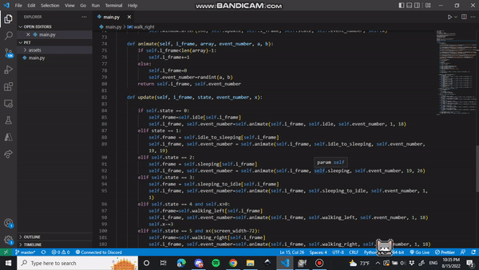

# 🐱 Desktop Cat — Enhanced Edition


> A delightful interactive desktop companion that lives on your taskbar —
> sleeps, wanders, chases your cursor, and keeps you company.

---

## ✨ Features

### Behaviours
| State | Description |
|---|---|
| **Idle** | Sits and plays through idle animations |
| **Walking** | Strolls left or right across the screen |
| **Sleeping** | Falls asleep with ZZZ animation, wakes up later |
| **Chasing** | Runs toward your cursor when it moves |
| **Happy** | Plays a bright animation when you pet them |
| **Angry** | Grumbles briefly when disturbed mid-nap |

### Interactivity
- 🖱️ **Left-click** — Pet the cat (happy animation + beep)
- 🖱️ **Double-click** — Show a random speech bubble message
- 🖱️ **Right-click** — Context menu (pet, message, settings, quit)
- 🖱️ **Drag** — Pick up and reposition the cat anywhere on screen
- 🖎  **System tray** icon with full menu *(requires Pillow + pystray)*

### Settings Window
Access via right-click → Settings or the tray icon:
- Walk Speed slider
- Animation Speed slider
- Sprite Scale (1× – 4× pixel-art zoom)
- Toggle: Always on Top
- Toggle: Mouse Chasing
- Toggle: Sound Effects

### 🎨 7 Selectable Cat Versions / Skins
Switch cat skins in 1-click via Right-Click menu, System Tray menu, or Settings:

| Version | Skin | Description |
|---|---|---|
| **Shiro** | 🐱 | Pure snow-white cat with heterochromic eyes (blue & brown) |
| **Classic White** | 🤍 | Original white & light-grey pixel cat |
| **Midnight Black** | 🖤 | Sleek dark charcoal cat with yellow eyes |
| **Orange Tabby** | 🧡 | Warm ginger/orange cat with soft stripes |
| **Calico Patch** | 🤍🧡🖤 | Tri-color patch cat (white, orange & black) |
| **Pastel Pink** | 🌸 | Soft sakura pastel pink cute cat |
| **Golden Honey** | 🍯 | Warm golden honey cat |
| **Cyberpunk Neon** | ⚡ | Electric cyan & magenta glowing cat |

### Technical
- 🎨 Nearest-neighbour sprite scaling for crisp pixel art at any size
- 🌈 Dynamic RGBA recoloring engine for real-time skin switching
- 💾 Config persisted to `~/.desktop_cat_config.json`
- 🖥️ Multi-monitor work-area detection (taskbar-aware)
- 🔊 Acoustic source-filter synthesised sounds (meow, purr, happy chirp, angry yowl)
- ✅ Graceful fallbacks if optional dependencies are not installed

---

## 🚀 Getting Started

### Requirements

| Package | Required? | Purpose |
|---|---|---|
| `pywin32` | Recommended | Taskbar-aware screen detection |
| `Pillow` | Recommended | Pixel scaling + tray icon art |
| `pystray` | Optional | System tray icon & menu |

### Installation & Run

```bash
# Clone the repo
git clone https://github.com/theturkishangorashiro-art/Desktop-Cat.git
cd Desktop-Cat

# Install dependencies
pip install -r requirements.txt

# Launch
python main.py
```

---

## 🕹️ Controls

| Input | Action |
|---|---|
| Left-click | Pet the cat 🐾 |
| Double-click | Show speech bubble 💬 |
| Right-click | Open context menu ⚙️ |
| Click + drag | Move cat anywhere on screen |
| `Esc` | Quit |
| Tray icon | Show / hide, settings, quit |

---

## ⚙️ Configuration

Settings are auto-saved to `~/.desktop_cat_config.json`:

```json
{
  "speed": 3,
  "scale": 2,
  "anim_ms": 150,
  "always_on_top": true,
  "mouse_chasing": true,
  "sound": true,
  "pos_x": -1,
  "pos_y": -1
}
```

> Delete this file to reset all settings to defaults.

---

## 📸 Demo



---

## 👤 Author

**Shubham**

[](https://www.linkedin.com/in/shubham-sunil-kumar-333547133/)
[](https://github.com/theturkishangorashiro-art)
[](https://github.com/sponsors/theturkishangorashiro-art)

- 🔗 **LinkedIn:** [linkedin.com/in/shubham-sunil-kumar-333547133](https://www.linkedin.com/in/shubham-sunil-kumar-333547133/)
- 🐙 **GitHub:** [github.com/theturkishangorashiro-art](https://github.com/theturkishangorashiro-art)
- 💖 **Support me:** [github.com/sponsors/theturkishangorashiro-art](https://github.com/sponsors/theturkishangorashiro-art)

---

## 📄 License

This project is open-source. See [`LICENSE`](LICENSE) for details.
